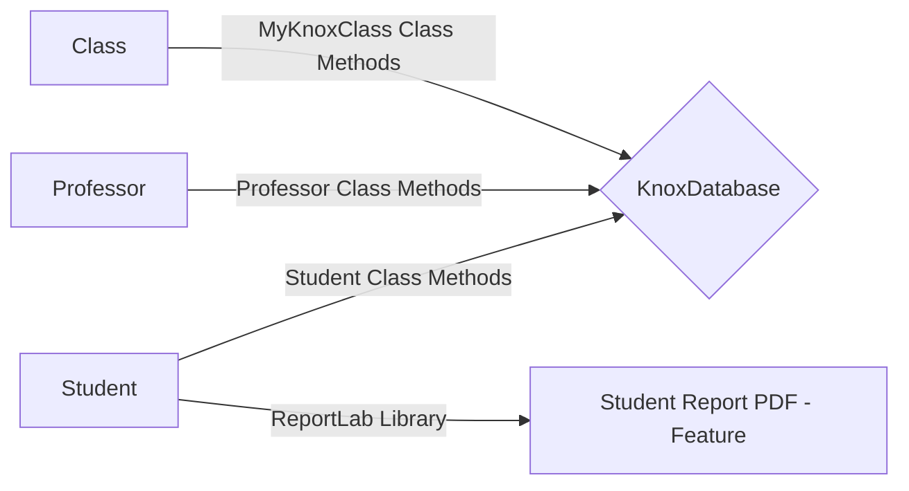

# Welcome to MyKnoxModel!
This repo contains Python classes to model students, professors, courses, classes and majors at Knox College. The code 

# Classes 

## MyKnox Class
Use:

Methods: 

## Professor Class
Use:

Methods: 

## Student Class
Use:

Methods: 

## Major Class

Use:

Methods: 
# Student Report PDF - Feature

Use:

Methods: 

# KnoxDatabase

All classes are linked with the KnoxDatabase for synchronisation of student, professor, major department and class offering records. The flowchart below visualises the structure of this project.

