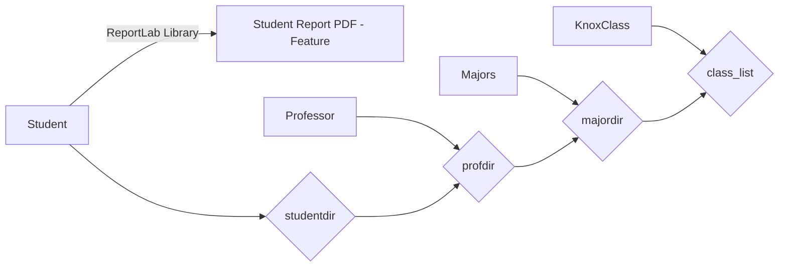

# Welcome to MyKnoxModel!
This repo contains Python classes to model students, professors, courses, classes and majors at Knox College. The code 

## MyKnox Class
Use: instance = KnoxClass(String classname, Major majordept, Int period, List[] Professor)

Methods: 
    newclassoffering(Student student, KnoxClass class): Add a new class being
    offered at Knox to the classes directory

    periodchange(String majorname, KnoxClass class, Int newperiod): Change period of an existing class in the database

    add_faculty(String najorname, KnoxClass classname, Professor facultyname): adds a faculty to a KnoxClass instance's list of instructors

    remove_faculty(String najorname, KnoxClass classname, Professor facultyname): removes a faculty to a KnoxClass instance's list of instructors    

## Professor Class
Use: instance = Professor(String name, Major majordept, String email, Int knoxid, List[] classesteaching, List[] advisees)

Methods: 

    add_class/remove_class(String Profname, String classname): Add/remove KnoxClass instance to a professor's list of classes they're teaching

    add_avisee/remove_advisee(Professor prof, Student advisee): Add/remove an advisee

## Student Class
Use: instance = Student(String name, Major majordept, Int knoxID, String email, List[] academicrecord, Professor advisor)

Methods: 
    
    takeclass/dropclass(Student student, KnoxClass class): Add drop class from Student's academic record

    

## Major Class

Use: instance = Major(String major, List[] requiredclasses)

Methods: 

    
    add_major/remove_major(Major majorname): adds/removes major offering from database

    requirements(KnoxClass classname, Major majorname): returns class requirements of a major

    classinmajorcheck(KnoxClass classname, Major majorname): returns boolean value indicating if a given class falls in given major or not 
# Student Report PDF - Feature (Beta)

Info: Uses ReportLab library to generate a PDF with information of given student

Methods: studentreport(Student student): returns pdf named (student+report).pdf inside the project folder

# KnoxDatabase

All classes are linked with the KnoxDatabase for synchronisation of student, professor, major department and class offering records. The flowchart below visualises the structure of this project.

